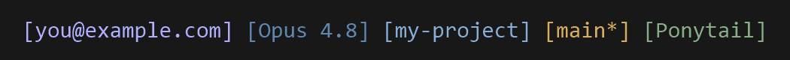

# claude-code-statusline

A clean, cross-platform status line for [Claude Code](https://claude.com/claude-code) — installs as a plugin and **configures itself**.

At a glance it shows **who you're logged in as, the model, where you are, your git branch, and any persistent skills/modes that are currently active** — each as a bracketed badge.



## Install

Inside Claude Code, run these two commands:

```
/plugin marketplace add iripple/claude-code-statusline
/plugin install claude-code-statusline@claude-code-statusline
```

Then open a new session. On first start the plugin writes the `statusLine` entry in
`~/.claude/settings.json`, pointing at the bundled script for your OS (PowerShell on
Windows, bash on macOS/Linux). Nothing else to do.

> Already have your own `statusLine`? It's left untouched — the plugin only sets one when none exists.

## What it shows

| Badge | Source |
|-------|--------|
| `[email]` | Claude Code account, read live from `~/.claude.json` — updates when you switch accounts |
| `[model]` | current model |
| `[folder]` | current working directory (leaf name) |
| `[branch*]` | git branch; `*` = uncommitted changes; `[]` when not a git repo |
| `[Skill]` | a **persistent skill/mode** that is currently active (see below) |

## Active skill badges

Most tools run once and finish. A few stay *active* across turns — for example the
[ponytail](https://github.com/DietrichGebert/ponytail) "lazy mode". This status line
surfaces them so you always know what is silently shaping the session.

The convention is a flag file:

- A skill writes `~/.claude/.<name>-active` while active, and deletes it when it stops.
- Optional: the file's first line is a mode (e.g. `ultra`).
- The badge renders `[Name]`, or `[Name:Mode]` when the mode isn't `full`.

Any tool can opt in just by creating that file — no change to this status line needed.

## Manual install (without the plugin)

1. Copy the script for your OS into your Claude config dir (`~/.claude`):
   - Windows: `statusline.ps1`
   - macOS / Linux: `statusline.sh` (then `chmod +x`)
2. Add to `~/.claude/settings.json`:

```jsonc
// Windows
"statusLine": { "type": "command",
  "command": "powershell -ExecutionPolicy Bypass -File \"C:\\Users\\<you>\\.claude\\statusline.ps1\"" }

// macOS / Linux
"statusLine": { "type": "command", "command": "bash ~/.claude/statusline.sh" }
```

## Customize

The scripts are short and linear — each badge is one block.

- **Reorder:** move the blocks.
- **Remove a badge:** delete its block.
- **Colors:** the numbers passed to `Col` / `col` are [256-color](https://en.wikipedia.org/wiki/ANSI_escape_code#8-bit) codes.
- **Show account name instead of email:** swap `emailAddress` for `displayName`.

## Requirements

- Claude Code with plugin + status line support.
- `node` on `PATH` (the plugin's auto-setup hook uses it).
- `git` on `PATH` (for the branch badge).
- Windows: PowerShell 5.1+. macOS / Linux: bash.

## License

[MIT](LICENSE)
